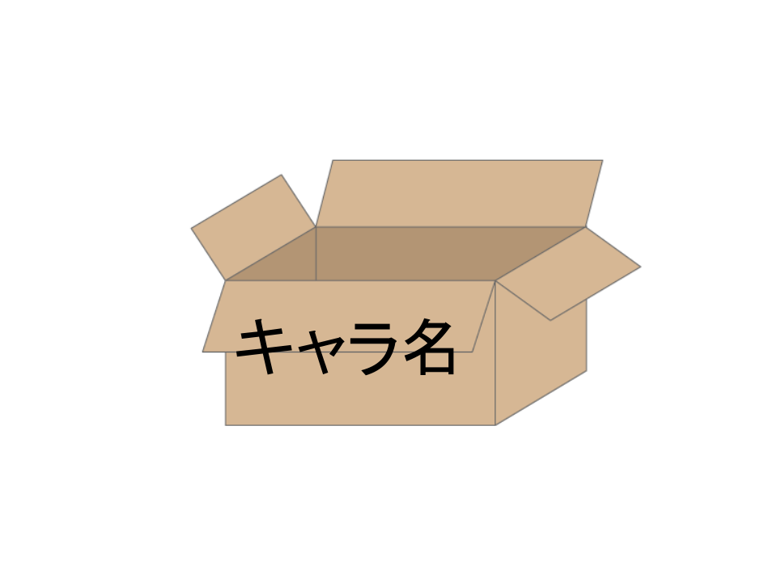

<!-- このファイルは直接編集せずに src ディレクトリ内を編集し build.pl を実行してください。 -->
#はじめてのプログラミング

___
### 自己紹介
- 名前 tomcha  
- twitter @tomcha_  
- blog Perlがくしゅう帳(Rubyも)  
___
- 仕事は事務員
- 仕事ではもっぱらWordとExcel
- 趣味でプログラミング

___
**Perl入学式　第一期生**

___

なので、スキルは  
###　
#素人+
###　
程度です。

___
### 宣伝
次回、Perl入学式in大阪は2月開催予定ですが、2014年度の最終回です。
2015年度は4月以降、初回からまた開催予定です。  
公式サイトがあるので、「Perl入学式」でググって下さい。

___
エンジニアのお祭りYAPC::Asia2014に行ってきました！

© Japan Perl Association
___
エンジニアのお祭りYAPC::Asia2014に行ってきました！

© Japan Perl Association
___
エンジニアのお祭りYAPC::Asia2014に行ってきました！

© Japan Perl Association
___
エンジニアのお祭りYAPC::Asia2014に行ってきました！

© Japan Perl Association
___
エンジニアのお祭りYAPC::Asia2014に行ってきました！

© Japan Perl Association
___
エンジニアのお祭りYAPC::Asia2014に行ってきました！

© Japan Perl Association
___
エンジニアのお祭りYAPC::Asia2014に行ってきました！

© Japan Perl Association
___
エンジニアのお祭りYAPC::Asia2014に行ってきました！

  
© Japan Perl Association
___
今年も開催されます！  
[http://yapcasia.org/2015/ja/](http://yapcasia.org/2015/ja/)
---
# 注意
- わかりやすくする為、極端なたとえや完全でない情報、厳密に言うと間違った情報があるかもしれません。
- プロでは無いので、不十分な知識の情報もあるかもしれません。
- なんとなくこんな感じかな？程度に受け止めてください。
___
### 今日のお題
1. こんなやり方
2. プログラム基礎知識
3. 書いてみよう

---
# こんなやり方
___
- 手を動かす
  + 小説を書きたい
  + 絵を描きたい
  + 作曲がしたい
  + サッカーが上手くなりたい
___
### とにかく書く！
- 写経
- Shut the fuck up and write some code!
___
### blogでアウトプット
- 勉強会で知らない単語に出会ったら、メモ。その場で調べる余裕がなければメモ。
- 家に帰ってからググって調べる。
- 調べた事、試した事はブログ記事にする。
  + 後日、忘れてしまって自分のブログを見返す事はよくあるパターン。
- ブログ記事が自分や後から学ぶ人の道標となる。
  + ただし、古い記事には要注意。
___
### 懇親会大事！
- 座って聞くだけなら、売ってる本読むのと大差がない。
- お酒の力を借りて、思い切って話しかけてみる。
- 直に話を聞く、顔見知りになるの大切。
---
# プログラミングとは

___
wikipediaで調べると  

___
### 命令を記述する道具
エディタ  
ワープロソフトとの違い  
___
### 色々なエディタ
- Emacs
- sublime text
- vim
- 簡単なもの
  - 黒い画面じゃなくても使えるもの
  - メモ帳
  - gedit
  - rubymineとかいうのもあるらしい
___
### どのエディタを選べば良い？
- 好きなものを使おう
- 身近に使ってる人がいる
- 習得コストがかかるので平行して学習
  + とりあえずはメモ帳などで
___
### UNIXコマンドを覚える
- cd
- pwd
- ls
- touch
___
### UNIXコマンド基礎
- cd は・・・
  - 今見てる場所（ディレクトリ、フォルダ、ファイルの保存場所）を移動するコマンド。  
  - tab キーを押すとヒントが出てくる。  
  - ~/ と ./ と ../ の意味
___
### UNIXコマンド基礎
- pwd は・・・
  - 今見ている場所の位置を画面に出すコマンド。
___
### UNIXコマンド基礎
- ls は・・・
  - 今見ている場所（ディレクトリ）の中身の一覧を画面に出すコマンド。
___
### UNIXコマンド基礎
- touch は・・・
  - ファイルを新規作成するコマンド。  
  - touch <スペース> ファイル名.拡張子　　と打つ。
    + 例）
    + touch hello.rb
___
### コードを書く前に
___
### 命令のパターン
- **上から順番に**
- **条件で分かれる**
- **同じこと、似たようなことを繰り返し**
___
### 上から順番に
___
### 上から順番に１行ずつ実行されます。
    #!/usr/bin/env ruby
    # encoding: utf-8
    
    n = gets.chomp.to_i
    
    array = Array.new
    n.times do
      array << gets.chomp.to_i
    end
    
    array.sort!
    
    max = array.pop
    while (max == array[-1])
      array.pop
    end
    puts array[-1]
___
### 順次イメージ

___
### 条件で分かれる
___
ドラクエで例えてみる　

___
### 分岐イメージ

___
### 同じこと、似たようなことを繰り返し
___
ドラクエで例えてみる

___
### ループイメージ

___
### テクニックの基礎
___
**変数**
___
変数は値の容れ物。よく箱で例えられる。

___
ドラクエで例えてみる

___
ドラクエで例えてみる(勇者とむちゃ)

___
ドラクエで例えてみる(勇者うつぼ)

___
ドラクエで例えてみる(勇者るびい)

___
プレイヤーによって、それぞれ名前が変わる。  
あらかじめプログラムにすべてのあらゆる名前を全て想定して記述する事は不可能。  
プレイヤーが設定した名前で対応するには？
___
＜名前を入力させる＞
 [変数]　に入力された名前を格納。

＜画面に出す＞
「おはよう [変数]。もうあさですよ。」
---
# 書いてみよう
___
### Rubyのプログラムが記述されたファイル
- 拡張子は.rb
- 保存する場所は決めておく
- 英字・アンダースコア（_）と数字
___
### 黒い画面に文字を出す
黒い画面に「Hello,world!」と出してみるプログラム。
    #usr/bin/env ruby

    puts 'Hello,world!'
___
### 先ほどのドラクエの・・・

- ＜名前を入力させる＞[変数]　に入力された名前を格納。
- ＜画面に出す＞「おはよう [変数]。もうあさですよ。」
___
### 黒い画面に文字を出す 応用編
黒い画面に「名前を入力させて」と「入力されたキャラクタ名で文章を表示させる」と出してみるプログラム。
    #usr/bin/env ruby

    puts 'なまえをいれてください >>>'
    player_name = gets.chomp
    puts "おはよう、#{player_name}。もう　あさですよ。"
---
Let's enjoy programing!
